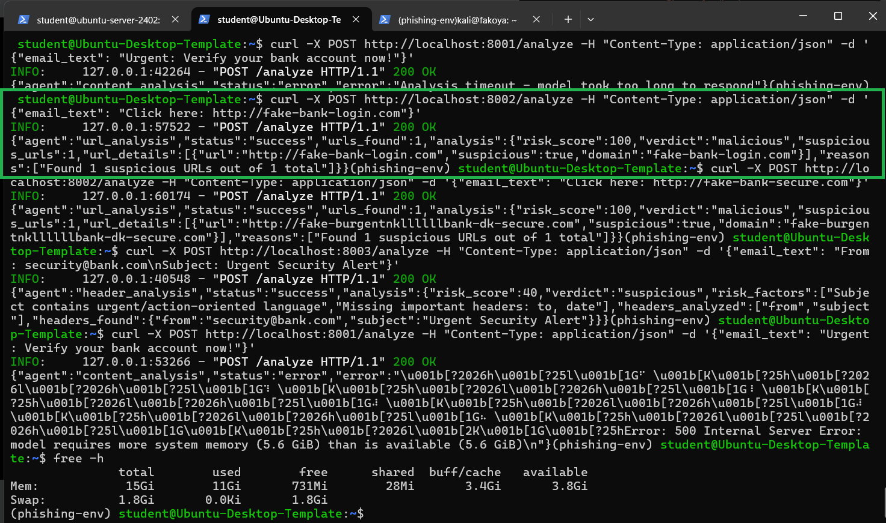
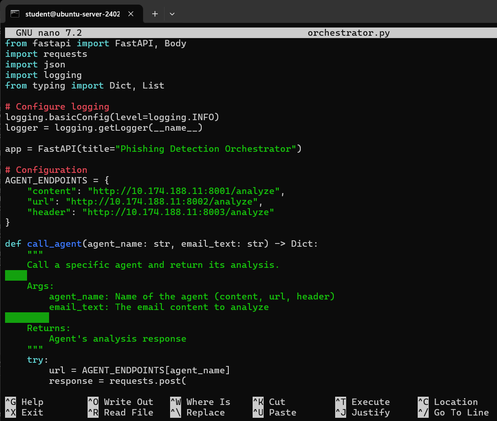

# Project: AI-Powered Phishing Email Detection System with A Multi-Agent Architecture

## Table of Contents
- [Overview](#overview)
- [Organizational Application](#organizational-application)
- [Configuration & Screenshots](#configuration--screenshots)
- [Observations, Challenges & Solutions](#observations-challenges--solutions)
- [Reflections](#reflections)
- [How to Reproduce](#how-to-reproduce)

---

## Overview
This project implements an AI-powered phishing email detection system using a multi-agent architecture with Llama LLM integration. The deployment involved creating specialized analysis agents (Content, URL, and Header analysis) running on Ubuntu Desktop VM (10.174.188.11) and a central orchestrator on Ubuntu Server (10.174.188.10), with testing conducted from a Kali Linux VM. The system first used the Llama 8B model but later switched to the smaller 3B version due to unexpected issues 🫣. This change shows the process of optimizing and solving challenges while creating a strong, enterprise-level security AI tool. The areas I failed are included as well, to really help understand the process or overcome them incase you are trying to build something similar, so ensure you pay attention to details. If you have any questions or suggestions, feel free to reach out to me on any social media platform.

NB: This is not a fully functional system tested in production. More refinements and optimizations would still be done to make it production-ready, A better LLM model would be used, and more agents would be added to the system. The system is more of a version 1.0.01 of the project, so expect more changes and improvements in the future.

---

## Organizational Application

### Use Case Scenario
A company needs to protect its employees from sophisticated phishing attacks that bypass traditional email filters. The AI phishing detection system provides:
- Real-time analysis of email content, URLs, and headers
- Natural language understanding of social engineering tactics
- Multi-faceted threat assessment through specialized agents

### Security Benefits
- **Advanced Threat Detection**: Uses AI to understand context and intent in phishing attempts
- **Multi-Layer Analysis**: Combines content, URL, and header analysis for comprehensive assessment
- **Real-time Processing**: Provides immediate threat scoring for rapid response
- **Adaptive Learning**: Can be extended with additional training data and models

---

## Configuration & Screenshots

### 1. Python Virtual Environment Setup and Package Installation - Ubuntu Desktop
- First attempt to create virtual environment failed due to missing packages  
- Installed required Python virtual environment packages (python3.10-venv and dependencies)  
  
*Failed virtual environment creation at first, then installed python3.10-venv to fix the issue on Ubuntu Desktop*

### 2. Virtual Environment Package Installation - Ubuntu Server
- Similar package installation on Ubuntu Server for consistency

*Installing python3.12-venv on Ubuntu Server*

### 3. Successful Virtual Environment Creation - Ubuntu Desktop
- Virtual environment successfully created after package installation

*Virtual environment created and activated on Ubuntu Desktop*

### 4. Successful Virtual Environment Creation - Ubuntu Server
- Virtual environment also created on Ubuntu Server

*Virtual environment activated on Ubuntu Server*

### 5. Package Installation in Virtual Environment (Both Systems)
- Installing required Python packages including FastAPI and dependencies on both machines

*Installing FastAPI, Uvicorn, and other dependencies*

### 6. Project Directory Creation on Ubuntu Server
- Creating dedicated directory for phishing detection project

*Creating phishing-detector directory for organized development*

### 7. Initial Ollama Setup and Service Conflict
- First Ollama setup encountering port conflict

*Ollama service conflict on port 11434*

### 8. Llama 8B Model Download
- Downloading the initial Llama 8B model for AI analysis

*Downloading llama3.1:8b model (4.9GB)*

### 9. Python Requests Installation on Kali
- Setting up testing environment on Kali Linux

*Installing requests library on Kali for testing*

### 10. Content Analysis Agent Development
- Creating the content analysis agent Python file


*Developing content-agent.py with FastAPI and LLM integration*

### 11. URL Analysis Agent Development
- Building the URL analysis agent for link detection


*Creating url-agent.py with URL parsing and analysis*

### 12. Header Analysis Agent Development
- Developing the header analysis agent for email metadata


*Building header-agent.py for email header analysis*

### 13. Multi-Agent Service Startup
- Starting all three analysis agents simultaneously

*Launching content, URL, and header agents on different ports*

### 14. URL Agent Successful Initial Testing
- URL agent successfully detecting suspicious URLs

*URL agent correctly identifying malicious domains*

### 15. Header Agent Successful Initial Testing
- Header agent properly analyzing email headers

*Header agent detecting suspicious header patterns*

### 16. Initial Content Agent Testing Failure
- Test failed due to insufficient storage when loading the Llama 8B model, causing JSON parsing errors.  
  
*Failure from low storage space; model returned raw output instead of parsed JSON.*  

### 17. Service Management and Optimization
- Stopping services to optimize model selection

*Stopping agents and removing large 8B model*

### 18. Llama 3B Model Download
- Downloading the more efficient Llama 3B model

*Replacing 8B with 3B model for better performance*

### 19. Content Agent Code Optimization
- Optimizing prompt engineering for better JSON output

*Improving prompt to enforce JSON response format*

### 20. Performance Testing Llama 3B
- Testing the 3B model's analysis capabilities and speed to adjust timeouts
- Test showed 1minute 7-second response time, I then increased the timeouts to 5minutes

*Manual testing showing 1minute 7-second response time*

### 21. Content Agent JSON Parsing Issues
- Still encountering JSON parsing challenges with LLM output

*LLM returning analysis text instead of structured JSON*

### 22. Content Agent Optimization & Restart
- Improved prompt design for better JSON output and restarted all agents with updated settings.  
- Updated content-agent.py is included in the repo for reference.
  
*Restart after optimizing content agent prompts and configurations on ports 8001, 8002, and 8003.*  

### 23. Successful Content Agent Analysis
- Content agent finally working with proper JSON output

*Content agent returning structured risk assessment*

### 24. Orchestrator Development
- Creating the central orchestrator to coordinate all agents


*Building orchestrator.py for multi-agent coordination*

### 25. Orchestrator Service Startup
- Launching the orchestrator service on port 8000

*Orchestrator running and ready to receive requests*

### 26. Cross-Network Testing from Kali
- Testing the complete system from external Kali machine

*Sending test requests from Kali to orchestrator*

### 27. Complete System Analysis - Malicious Email
- Full system analysis of a clearly malicious phishing email

*Orchestrator coordinating all agents for malicious email detection*

### 28. Orchestrator Log Output - Malicious Email
- Detailed logging showing agent coordination and analysis flow

*Logs showing successful agent coordination and analysis*

### 29. Second Cross-Network Testing from Kali
- Testing the complete system from external Kali machine

*Sending test requests from Kali to orchestrator*

### 30. Complete System Analysis - Safe Email
- System correctly identifying a safe marketing email

*Agents correctly classifying safe email with low risk score*

### 31. Orchestrator Log Output - Safe Email
- Detailed logging showing agent coordination and analysis flow

*Logs showing successful agent coordination and analysis*

---

## Observations, Challenges & Solutions

### Technical Challenges

**Virtual Environment Setup Issues**
- **Problem**: Initial virtual environment creation failed due to missing ensurepip
- **Solution**: Installed python3.10-venv and python3.12-venv packages on respective systems
- **Learning**: Different Ubuntu versions require specific venv packages

**Model Performance Optimization**
- **Problem**: Llama 8B model was too slow, needed more RAM😔
- **Solution**: Switched to Llama 3.2:3B model with significantly faster performance
- **Result**: Reduced response time 

**LLM Output Parsing Challenges**
- **Problem**: LLM returned unstructured text instead of clean JSON
- **Solution**: Fine-tuned prompt engineering to enforce JSON response format

**Service Coordination Complexity**
- **Problem**: Managing multiple agent services and their interdependencies
- **Solution**: Created orchestrator with timeout handling and error management
- **Improvement**: Implemented parallel agent execution for faster analysis

---

## Reflections

### Technical Learnings

**AI Integration Patterns**
- Integrated LLMs into security applications
- Effective prompt engineering techniques for structured output
- Developed understanding of model performance characteristics and trade-offs

**Performance Optimization**
- Understood the importance of model selection in AI applications
- Learned to balance accuracy requirements with performance constraints
- Developed techniques for optimizing AI inference in production systems

### Security Insights

**AI-Powered Threat Detection**
- Learned to leverage natural language understanding for social engineering detection
- Developed multi-layered analysis approaches for comprehensive threat assessment

**Enterprise Security Integration**
- Understood how to integrate AI systems into existing security infrastructure
- Learned to build systems that provide actionable security intelligence
- Developed approaches for making AI decisions explainable and auditable

### Development Journey

**Iterative Problem-Solving**
- Experienced the reality of AI development with constant iteration and refinement
- Learned to diagnose and fix complex integration issues
- Developed resilience in troubleshooting distributed systems

---

## How to Reproduce

### Prerequisites
- Ubuntu Desktop VM (10.174.188.11) for analysis agents
- Ubuntu Server VM (10.174.188.10) for orchestrator
- Kali Linux VM for testing
- Minimum 8GB RAM recommended for Llama models
- Network connectivity between all systems

### Step-by-Step Implementation

1. **Environment Setup on Ubuntu Desktop**
```bash
# Install Python virtual environment
sudo apt update
sudo apt install python3.10-venv python3-pip

# Create and activate virtual environment
python3 -m venv ~/phishing-env
source ~/phishing-env/bin/activate

# Install required packages
pip install fastapi uvicorn requests
```

2. **Ollama Installation and Model Setup**
```bash
# Install Ollama
curl -fsSL https://ollama.ai/install.sh | sh

# Download Llama 3.2 3B model (recommended for performance)
ollama pull llama3.2:3b

# Verify model installation
ollama list
```

3. **Development of Analysis Agents**

**Content Analysis Agent (content-agent.py)**
```python
from fastapi import FastAPI, Body
import subprocess
import json
import re

app = FastAPI(title="Content Analysis Agent")

#Check the content-agent.py in this repo for the remaining code
```

**URL Analysis Agent (url-agent.py)**
```python
from fastapi import FastAPI, Body
import re
from urllib.parse import urlparse

app = FastAPI(title="URL Analysis Agent")

#Check the url-agent.py in this repo for the remaining code
```

**Header Analysis Agent (header-agent.py)**
```python
from fastapi import FastAPI, Body
import re

app = FastAPI(title="Header Analysis Agent")

#Check the url-agent.py in this repo for the remaining code
```

4. **Orchestrator Development on Ubuntu Server**

**Orchestrator (orchestrator.py)**
```python
from fastapi import FastAPI, Body
import requests
import logging
from datetime import datetime

logging.basicConfig(level=logging.INFO)

#Check the orchestrator.py in this repo for the remaining code
```

5. **Service Deployment and Testing**

**Start Analysis Agents (Ubuntu Desktop)**
```bash
# Activate environment
source ~/phishing-env/bin/activate

# Start agents in background
python3 content-agent.py &
python3 url-agent.py & 
python3 header-agent.py &

# Verify services are running
curl http://localhost:8001/analyze -X POST -H "Content-Type: application/json" -d '{"email_text": "Test"}'
```

**Start Orchestrator (Ubuntu Server)**
```bash
# Activate environment
source ~/phishing-env/bin/activate

# Start orchestrator
python3 orchestrator.py

# Service will run on http://0.0.0.0:8000
```

**Test from Kali Linux**
```bash
# Test malicious email
curl -X POST http://10.174.188.10:8000/analyze-email \
  -H "Content-Type: application/json" \
  -d '{"email_text": "From: security@bank.com\nSubject: Urgent Account Verification Required\n\nDear Customer,\n\nWe detected suspicious activity. Verify your account now: http://fake-bank-login.com/secure\n\nClick immediately to avoid account suspension!"}'

# Test safe email  
curl -X POST http://10.174.188.10:8000/analyze-email \
  -H "Content-Type: application/json" \
  -d '{"email_text": "From: newsletter@company.com\nSubject: Monthly Update\n\nHello Team,\n\nHere is our monthly newsletter with updates and news.\n\nBest regards,\nThe Company Team"}'
```

### Configuration Notes
```bash
# Ensure firewall rules allow communication between VMs on required ports
# Monitor Ollama memory usage and adjust model size if needed
# Implement proper error handling and logging for production use
# Consider adding rate limiting and authentication for security
# Test with various email samples to validate detection accuracy
```
